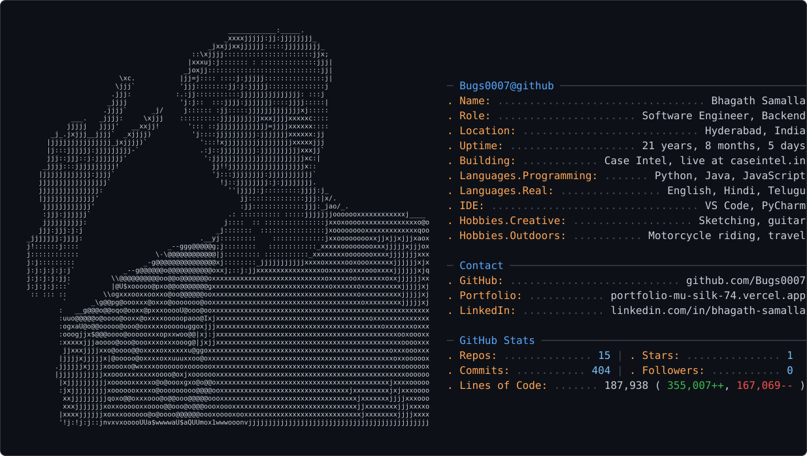

  <a href="https://github.com/jeantimex/neofetch-profile">
    <picture>
      <source media="(prefers-color-scheme: dark)" srcset="dark_mode.svg" />
      <source media="(prefers-color-scheme: light)" srcset="light_mode.svg" />
      
    </picture>
  </a>

